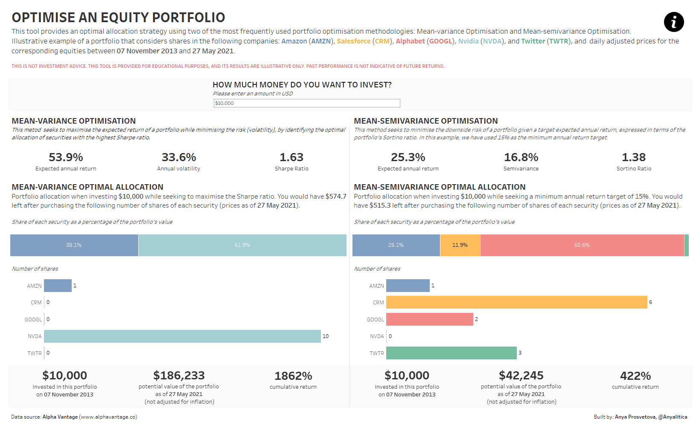
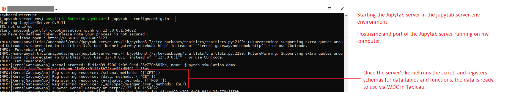
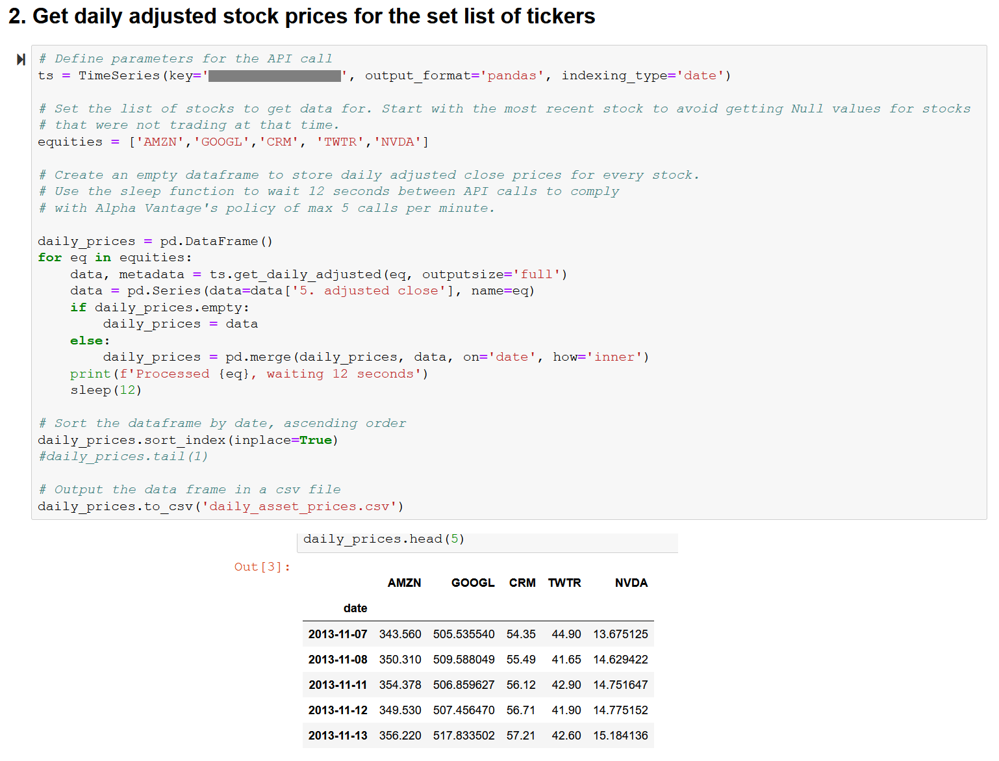

# Optimise an equity portfolio in Tableau

## Tableau DataDev Hackathon - May 2021

## Overview

This tool provides an optimal allocation strategy using two of the most frequently used portfolio optimisation methodologies: Mean-variance Optimisation and Mean-semivariance Optimisation. A user inputs an amount of money they want to invest using a parameter at the top of the dashboard, and the Python script calculates the number of shares they should consider buying for each methodology. This is an illustrative example of a portfolio that considers shares in the following companies: Amazon (AMZN), Salesforce (CRM), Alphabet (GOOGL), Nvidia (NVDA), and Twitter (TWTR).

THIS IS NOT INVESTMENT ADVICE. THIS TOOL IS PROVIDED FOR EDUCATIONAL PURPOSES, AND ITS RESULTS ARE ILLUSTRATIVE ONLY. PAST PERFORMANCE IS NOT INDICATIVE OF FUTURE RETURNS.

See a short [demo of the dashboard on YouTube](https://youtu.be/xpUpi8hCjoo).

## How it works

I used the following tools:

- [Jupytab](https://github.com/CFMTech/Jupytab): a webserver that allows to explore in Tableau data generated dynamically by a Jupyter Notebook. It's built on the basis of Tableau's Web Data Connector (WDC) and the Jupyter Kernel Gateway.

I followed this step-by-step [tutorial by Brian Tribondeau on how to install and run Jupytab server](https://towardsdatascience.com/interactive-simulation-with-tableau-and-jupytab-c26adb1be564) to set up the connection between Tableau and my Python script in the Jupyter notebook called **portfolio-optimisation.ipynb**. See the **config.ini** file needed for the Jupytab server for this project for configuration details.

- Jupyter notebook with my Python script (**portfolio-optimisation.ipynb**)
- Tableau Desktop
- Analytics Extension API to trigger Python functions in the Jupyter notebook based on the parameter value entered by a user.

In my example, the Jupyter notebook and Jupytab server run in two separate environments, using Windows Subsystem for Linux for Windows 10.

The Python script in this project has two parts: static and dynamic.

**Static part**:

This part of the script is not updated based on user's inputs in Tableau dashboard. The Python script in **portfolio-optimisation.ipynb** for this part does the following:

- sends a query to the [Alpha Vantage API](https://www.alphavantage.co/documentation/) to get daily adjusted stock prices for the set list of equities (Amazon (AMZN), Salesforce (CRM), Alphabet (GOOGL), Nvidia (NVDA), and Twitter (TWTR))

- calculates expected return, volatility, semivariance, Sharpe and Sortino ratios for the portfolio using Mean-variance Optimisation and Mean-semivariance Optimisation methodologies.
- sends two dataframes back to Tableau using the Jupytab WDC:
  - daily adjusted prices for each equity on the first and the last dates in the data set (**final_combined_df** in the Python script, **Main table** in Tableau Desktop)
  - weights and portfolio summary details for both methodologies (**portfolio_summary_combined** in the Python script, **Portfolio summary** in Tableau Desktop).

**Dynamic part**:

A dashboard user can set how much money they want to invest in a portfolio using a parameter on the dashboard called **Set portfolio value**. This input triggers several functions in the Python script in **portfolio-optimisation.ipynb** that recalculate the number of shares a user should buy under each methodology, and the amount of money that will be left afterwards. This happens in real time (using the Analytics Extension API and Jupytab server), no refresh or reload of the dashboard needed.

These functions in the Python script are triggered by the value in the **Set portfolio value** parameter:

- **leftover_sharpe_f**: Leftover amount (in USD) after investing in a Mean-variance portfolio
- **leftover_es_f**: Leftover amount (in USD) after investing in a Mean-semivariance portfolio
- **allocation_es_f**: Number of shares for each equity in a Mean-semivariance portfolio
- **allocation_sharpe_f**: Number of shares for each equity in a Mean-variance portfolio

An example of a function:

## Tableau tools used

- Web Data Connector
- Analytics Extension API

## Potential future improvements

There are several features I'd like to add to this project in future:

- at the moment the list of equities is fixed in the Python script. I'd like to see if it's possible to allow users to select equities they want to include in their portfolio directly in the dashboard
- add other methodologies of portfolio optimisation to the dashboard
- for this project the Jupytab server and the Jupyter notebook are running on my local computer. I tried to set it up on an AWS EC2 instance to make it always available, but didn't have enough time to configure it properly. I'd like to get back to this idea after the hackathon, and make sure the calculations work when I publish the workbook on Tableau Server.
